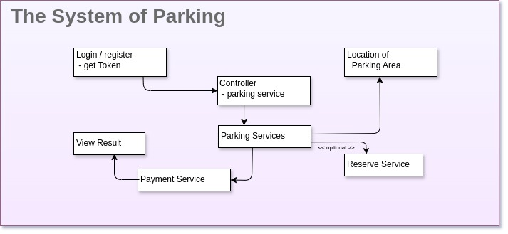

   # The Parking Areas

   * [Technologies](#technologies)
   * [Setup](#setup)

**Technologies**
  <ul>
    <li>PHP 8.2, Symfony 7</li>
    <li>Docker, Docker Compose</li>
    <li>Debian 10/11 with Makefile</li>
    <li>Makefile for Windows 10/11(current is in testing)</li>
    <li>Mysql, Nginx, Redis</li>
  </ul>

   ## 01. Initial project setup

### Design of Parking System

 

  
<b>Click here:</b> <i>The System of Parking</i> - Design.

   * 
  

### Environments and build targets

  01. [x] Implement environment on Docker for run Demo

 Final goal is a setup that can use containers for:
<ul>
    <li>local development</li>
    <li>in a CI/CD pipeline</li>
    <li>on stage preproduction and production</li>
</ul>
     and even though strive to for a parity between those different environments,
    there will be differences due to fundamentally different requirements. E.g.
<ul>
    <li>in production, a container containing source code without any test dependencies is used</li>
    <li>on CI, a container containing source code with test dependencies is used</li>
    <li>locally, a container is used that mounts source code from the local host (including dependencies)</li>
</ul>  

  In this publication I have included only part of the solution that facilitates implementation
    monitoring systems, metrics modules, scaling the entire system, e.g. using Kubernetes.

 The entire structure is managed in a very easy and flexible way using (self-documenting)
Makefile scripts.

 These Makefile scripts run on Debian 10/11 Linux systems,
for Windows 10/11 are under testing and development.

** Setup **
  02. [x] Building, running and testing Docker containers

  [console commands]:
    $ make

    $ make make-init
      (w przypadku braku Makefile wykonać komendy =>):
      $ cp .make/.env.example .make/.env && for variable in ; do echo $variable | tee -a .make/.env; done

build all containers:

  $ make docker-build  
    =>  
    $ cp ./.docker/.env.example ./.docker/.env && \
    ENV=local TAG=latest DOCKER_REGISTRY=docker.io DOCKER_NAMESPACE=kosowski76 APP_USER_ID=101 APP_GROUP_ID=111 APP_USER_NAME=develop docker compose -p   parkignArea_local --env-file ./.docker/.env -f ./.docker/docker-compose/docker-compose-php-host.yml build php-host && \
    ENV=local TAG=latest DOCKER_REGISTRY=docker.io DOCKER_NAMESPACE=kosowski76 APP_USER_ID=101 APP_GROUP_ID=111 APP_USER_NAME=develop docker compose -p   parkignArea_local --env-file ./.docker/.env -f ./.docker/docker-compose/docker-compose.yml -f ./.docker/docker-compose/docker-compose.local.yml build

  $ make docker-up  
    =>  
    $ ENV=local TAG=latest DOCKER_REGISTRY=docker.io DOCKER_NAMESPACE=kosowski76 APP_USER_ID=101 APP_GROUP_ID=111 APP_USER_NAME=develop docker compose -p parkignArea_local --env-file ./.docker/.env -f ./.docker/docker-compose/docker-compose.yml -f ./.docker/docker-compose/docker-compose.local.yml up -d 

  $ make docker-test  
    =>  
    $ bash ./.docker/docker-test.sh

  ! How you can see, work is much more comfortable and effective
